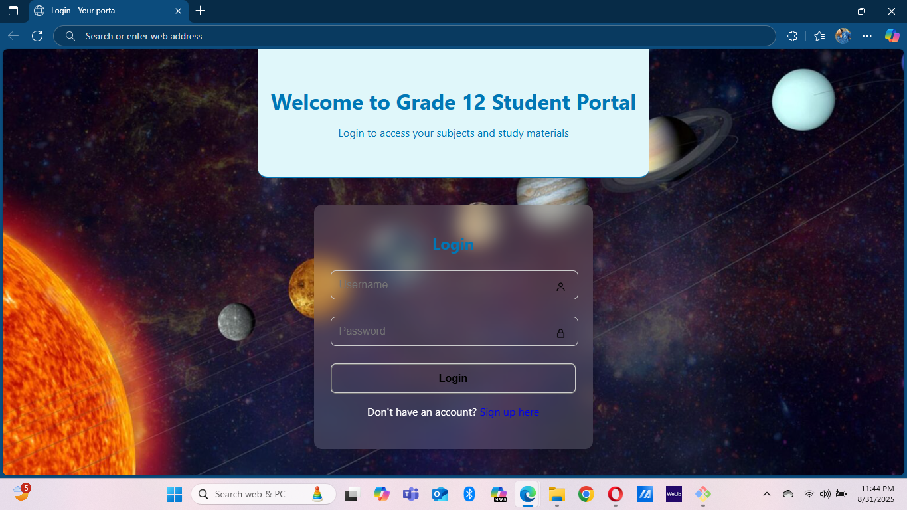
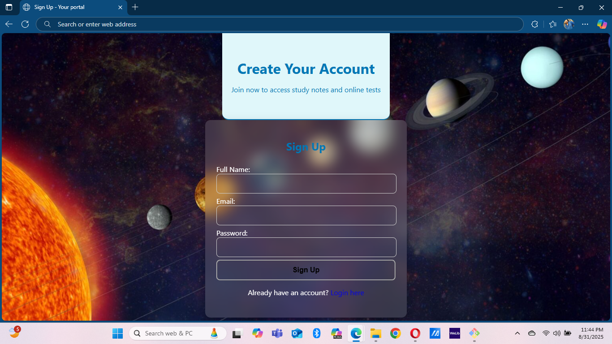
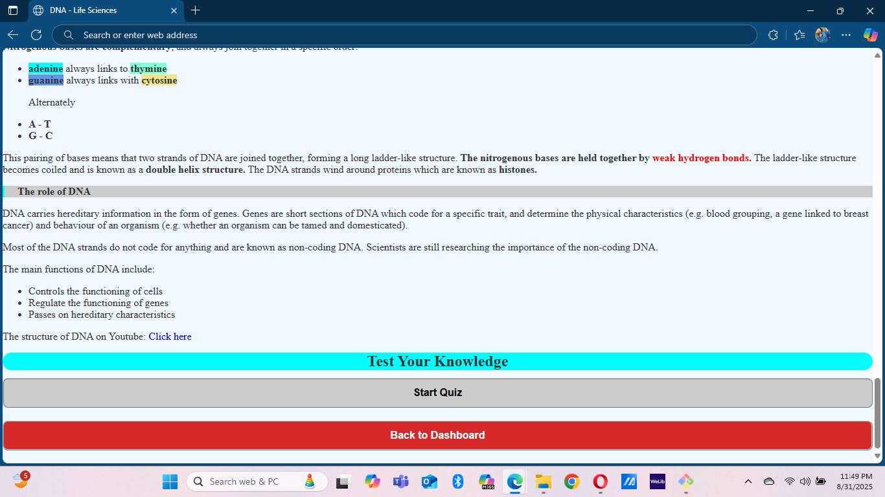
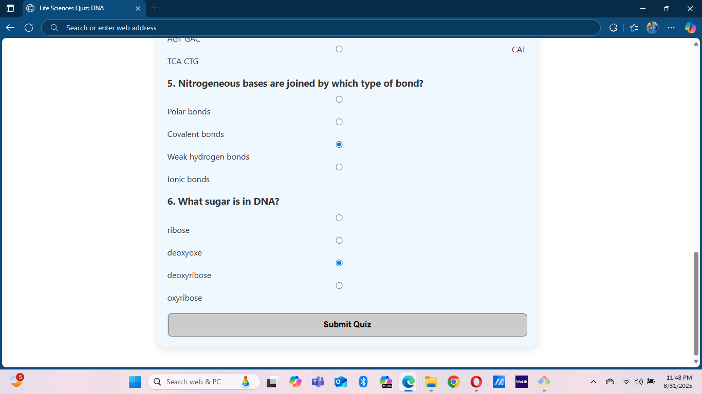
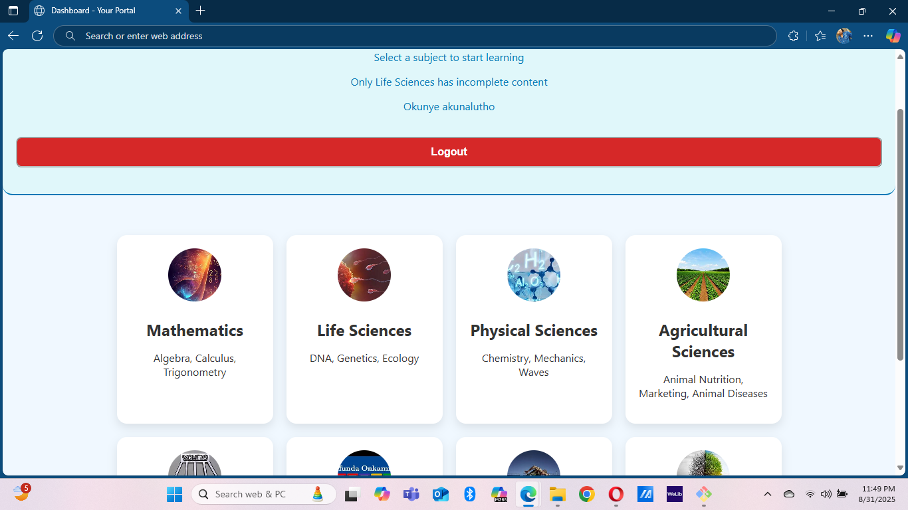
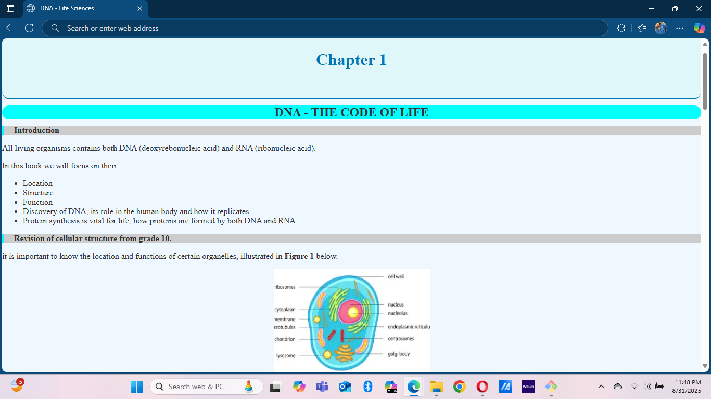
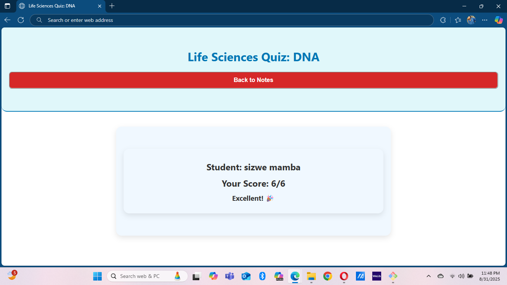

# 🎓 Student Portal - Grade 12

The **Student Portal** is a web-based platform designed for Grade 12 science stream learners. 
It also provides an interactive **quiz system.**

## ✨ Features
- 🔑 **Login system** (simulates two students for now)
- 🧬 **DNA Quiz** with multiple questions
- 📊 **Final score display** at the end of the quiz
- 🎨 Clean and simple **HTML & CSS design**

## 🛠️ Technologies Used
- HTML
- CSS
- JavaScript (for quiz logic)

## 🚀 How to Run
1. Clone this repository:
   ```bash
   git clone https://github.com/YOUR-USERNAME/student-portal.git

## 🔗 Live Demo
<p align="center">
  <a href="https://simangaliso24.github.io/Student-Portal/" target="_blank">
    
  </a>
</p>


## 📸 Screenshots

| Login | Signup | Start Quiz |
|-------|--------|------------|
|  |  |  |

| Quiz | Subjects | Notes | Final Score |
|------|---------|-------|------------|
|  |  |  |  |
